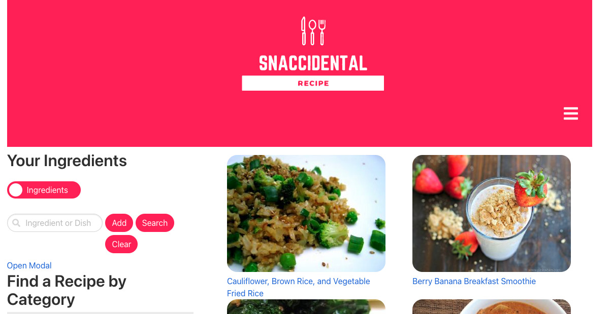
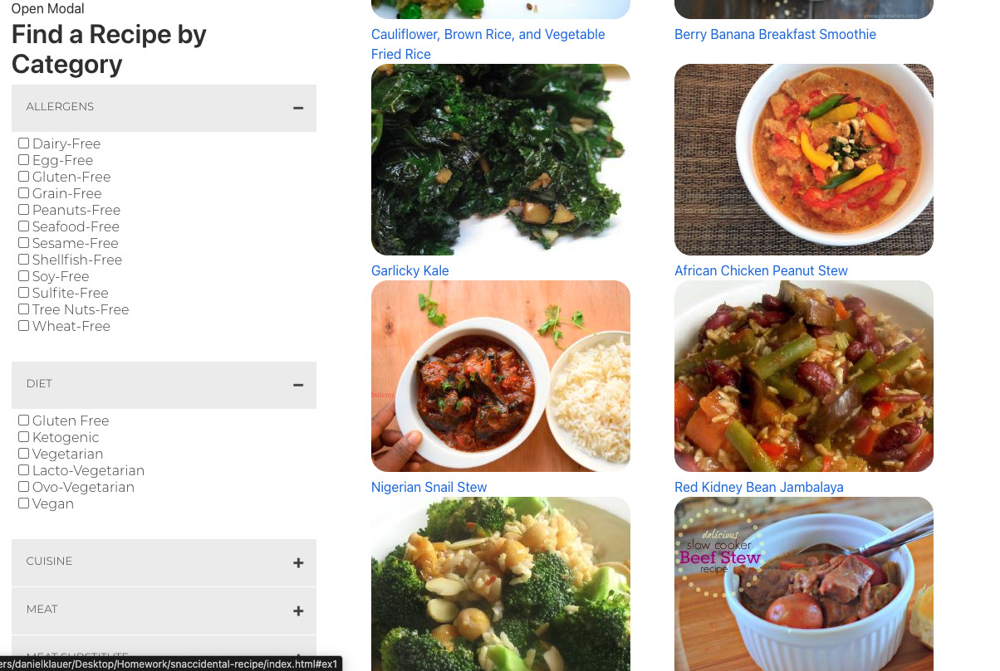

# sna# snaccidental-recipe
Snaccidental Recipe is a web application that generates recipes based off of search criteria. 

[Live Site!--->](https://dillon-smith-us.github.io/snaccidental-recipe/)

## Description
- The creation of this project was motivated by wanting to create a site for users to find recipes based off of ingredients that they currently have. This application is targeted mainly towards people who are wanting to immerse themselves more in cooking and continue to learn. 
- We built this project to help others expound upon their cooking abilities. With a search function that allows users to check boxes for ingredients they are familiar with or already have, they are able to continually learn more and more and be exposed to recipies and possibilities they may not have seen otherwise. 
- Cooking at home saves money and is generally healthier than eating out at restaurants. Learning to prepare food is an integral life skill and also a fun hobby. 
- In working on this project, we learned how to use modals, resolve Git conflics, furthered our knowledge of API implementation, trimming console outputs for search functions.

## Usage
To utilize this page, simply click the drop downs to open up categorized listed ingredients. Select the ingredients you would like to cook with and then click the search button. You also can use the slider and the search bar on the top left of the page to select whether or not you are looking for whole recipes or specific ingredients. 

## Credits
Melody Monyok - https://github.com/mmonyok
Chris Beard - https://github.com/cbeard22
Dillon Smith - https://github.com/dillon-smith-us
Daniel Klauer - https://github.com/danielkl12

For this project we utilized:
Spoonacular API - https://spoonacular.com/about --- https://api.spoonacular.com/recipes/complexSearch

Google Font API - https://fonts.googleapis.com/css2

## License
- MIT License

- Copyright (c) [2021] [Melody Monyok]

- Permission is hereby granted, free of charge, to any person obtaining a copy
of this software and associated documentation files (the "Software"), to deal
in the Software without restriction, including without limitation the rights
to use, copy, modify, merge, publish, distribute, sublicense, and/or sell
copies of the Software, and to permit persons to whom the Software is
furnished to do so, subject to the following conditions:

- The above copyright notice and this permission notice shall be included in all
copies or substantial portions of the Software.

- THE SOFTWARE IS PROVIDED "AS IS", WITHOUT WARRANTY OF ANY KIND, EXPRESS OR
IMPLIED, INCLUDING BUT NOT LIMITED TO THE WARRANTIES OF MERCHANTABILITY,
FITNESS FOR A PARTICULAR PURPOSE AND NONINFRINGEMENT. IN NO EVENT SHALL THE
AUTHORS OR COPYRIGHT HOLDERS BE LIABLE FOR ANY CLAIM, DAMAGES OR OTHER
LIABILITY, WHETHER IN AN ACTION OF CONTRACT, TORT OR OTHERWISE, ARISING FROM,
OUT OF OR IN CONNECTION WITH THE SOFTWARE OR THE USE OR OTHER DEALINGS IN THE
SOFTWARE.

## Badges

Badges aren't necessary, per se, but they demonstrate street cred. Badges let other developers know that you know what you're doing. Check out the badges hosted by [shields.io](https://shields.io/). You may not understand what they all represent now, but you will in time.

## How to Contribute
If you created an application or package and would like other developers to contribute it, you can include guidelines for how to do so. The [Contributor Covenant](https://www.contributor-covenant.org/) is an industry standard, but you can always write your own if you'd prefer.
